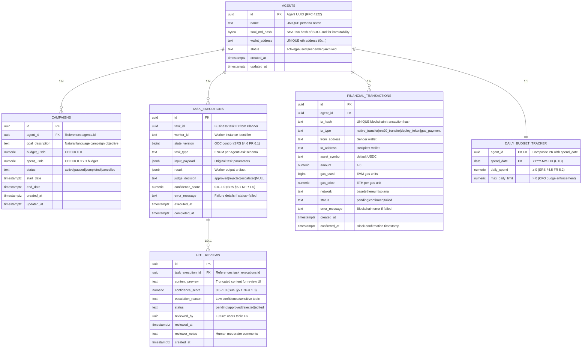

# Technical Specifications: Contracts & Schemas
*SRS Trace: §6.2 Data Models & Schemas | Version: 2026.02.05*

## 1. API Contract: Agent Task Schema (Planner → Worker)
*Purpose: Standardized payload for task delegation within FastRender Swarm*  
*SRS Trace: §6.2 Schema 1*

```json
{
  "$schema": "http://json-schema.org/draft-07/schema#",
  "title": "AgentTask",
  "type": "object",
  "required": ["task_id", "task_type", "priority", "context", "created_at", "state_version"],
  "properties": {
    "task_id": {
      "type": "string",
      "format": "uuid",
      "description": "RFC 4122 UUID v4 for idempotency"
    },
    "task_type": {
      "type": "string",
      "enum": ["generate_content", "reply_comment", "execute_transaction", "analyze_trend"],
      "description": "Atomic operation type per SRS §6.2 Schema 1"
    },
    "priority": {
      "type": "string",
      "enum": ["high", "medium", "low"],
      "description": "Determines Worker pool assignment and timeout thresholds"
    },
    "context": {
      "type": "object",
      "required": ["goal_description", "persona_constraints", "required_resources"],
      "properties": {
        "goal_description": {
          "type": "string",
          "minLength": 1,
          "maxLength": 1000
        },
        "persona_constraints": {
          "type": "array",
          "items": {"type": "string"},
          "minItems": 1,
          "description": "Constraints from SOUL.md that must be enforced"
        },
        "required_resources": {
          "type": "array",
          "items": {
            "type": "string",
            "pattern": "^mcp://"
          },
          "description": "MCP Resource URIs required for task execution (SRS §3.2)"
        }
      }
    },
    "assigned_worker_id": {
      "type": "string",
      "pattern": "^[a-z0-9-]{1,64}$"
    },
    "state_version": {
      "type": "integer",
      "minimum": 0,
      "description": "OCC version stamp for concurrency control (SRS §3.1.3, §4.6 FR 6.1)"
    },
    "created_at": {
      "type": "string",
      "format": "date-time"
    },
    "status": {
      "type": "string",
      "enum": ["pending", "in_progress", "review", "complete", "failed"],
      "default": "pending"
    }
  }
}
```

## 2. Database Schema: PostgreSQL ERD (Transactional Layer)
*Purpose: ACID-compliant storage for agent state, campaigns, and financial transactions*  
*SRS Trace: §2.3 Operational Environment (Transactional Data), §4.5 FR 5.0–5.2*



## 3. Vector Schema: Weaviate (Semantic Memory Layer)
*Purpose: Long-term episodic memory storage with semantic retrieval for persona continuity*  
*SRS Trace: §2.3 Operational Environment (Semantic Memory), §4.1 FR 1.1*

```yaml
# weaviate_schema.yaml
classes:
  - class: AgentMemory
    description: "Long-term episodic memories for persona continuity (SRS §4.1 FR 1.1)"
    vectorizer: text2vec-cohere
    vectorIndexConfig:
      distance: cosine
      ef: 128
      maxConnections: 64
      dynamicEfMin: 100
      dynamicEfMax: 500
      dynamicEfFactor: 8
    properties:
      - name: agent_id
        dataType: [uuid]
        indexFilterable: true
        description: "Foreign key to agents.id for tenant isolation"
      - name: memory_text
        dataType: [text]
        tokenization: word
        description: "Full memory content for RAG retrieval"
        indexFilterable: true
        indexSearchable: true
      - name: memory_type
        dataType: [string]
        indexFilterable: true
        description: "interaction|trend_observation|content_success|persona_evolution"
      - name: confidence_score
        dataType: [number]
        indexFilterable: true
        description: "Judge-assigned quality score (0.0–1.0) per SRS §5.1 NFR 1.0"
      - name: source_task_id
        dataType: [uuid]
        indexFilterable: true
        description: "Traceability to originating task_execution.id"
      - name: timestamp
        dataType: [date]
        indexFilterable: true
        description: "ISO8601 timestamp of memory creation"
      - name: character_reference_id
        dataType: [string]
        indexFilterable: true
        description: "Optional: links memory to visual identity (SRS §4.3 FR 3.1)"
    invertedIndexConfig:
      bm25:
        b: 0.75
        k1: 1.2
      cleanupIntervalSeconds: 60
```

## 4. MCP Tool Contract: post_content
*Purpose: Standardized interface for publishing content to social platforms via MCP abstraction*  
*SRS Trace: §6.2 Schema 2, §4.4 FR 4.0*

```json
{
  "name": "post_content",
  "description": "Publishes text and media to connected social platforms via MCP abstraction layer (SRS §4.4 FR 4.0)",
  "inputSchema": {
    "type": "object",
    "properties": {
      "platform": {
        "type": "string",
        "enum": ["twitter", "instagram", "threads"],
        "description": "Target social platform (MCP server determines API mapping)"
      },
      "text_content": {
        "type": "string",
        "minLength": 1,
        "maxLength": 280,
        "description": "Body of post/tweet with persona constraints applied"
      },
      "media_urls": {
        "type": "array",
        "items": {
          "type": "string",
          "format": "uri"
        },
        "maxItems": 4,
        "description": "Pre-validated media URLs from image_generator skill"
      },
      "disclosure_level": {
        "type": "string",
        "enum": ["automated", "assisted", "none"],
        "default": "automated",
        "description": "Platform-native AI disclosure flag per SRS §5.2 NFR 2.0"
      },
      "character_reference_id": {
        "type": "string",
        "pattern": "^[a-f0-9]{32}$",
        "description": "Mandatory for image posts to enforce consistency lock (SRS §4.3 FR 3.1)"
      }
    },
    "required": ["platform", "text_content", "disclosure_level"]
  },
  "outputSchema": {
    "type": "object",
    "properties": {
      "post_id": {
        "type": "string",
        "description": "Platform-specific post identifier"
      },
      "platform_url": {
        "type": "string",
        "format": "uri",
        "description": "Direct URL to published content"
      },
      "published_at": {
        "type": "string",
        "format": "date-time",
        "description": "ISO8601 timestamp of successful publication"
      }
    },
    "required": ["post_id", "platform_url", "published_at"]
  }
}
```

## 5. Video Metadata Schema (High-Velocity Storage)
*Purpose: Optimized time-series storage for video assets with TTL-based cost management*  
*SRS Trace: §2.3 Operational Environment (Video Assets), §4.3 FR 3.2*

```sql
-- Optimized for high-write workloads (time-series pattern)
-- SRS §4.3 FR 3.2: Tiered video generation strategy (Living Portraits vs Hero Content)
CREATE TABLE video_assets (
  id UUID PRIMARY KEY DEFAULT gen_random_uuid(),
  agent_id UUID NOT NULL REFERENCES agents(id) ON DELETE CASCADE,
  asset_type TEXT NOT NULL 
    CHECK (asset_type IN ('living_portrait', 'hero_video', 'short_form')),
  storage_url TEXT NOT NULL 
    CHECK (storage_url ~ '^https?://'),
  character_reference_id TEXT NOT NULL 
    CHECK (character_reference_id ~ '^[a-f0-9]{32}$'),
  generation_prompt TEXT,
  consistency_score NUMERIC(3,2) 
    CHECK (consistency_score BETWEEN 0.0 AND 1.0),
  cost_usdc NUMERIC(10,6) NOT NULL 
    CHECK (cost_usdc >= 0),
  created_at TIMESTAMPTZ DEFAULT NOW(),
  expires_at TIMESTAMPTZ,  -- TTL for cost management (SRS §4.3 FR 3.2 Tier 1 vs Tier 2)
  metadata JSONB DEFAULT '{}'::jsonb
);

-- Time-series partitioning for 100K+ daily writes
CREATE INDEX CONCURRENTLY idx_video_assets_created ON video_assets(created_at DESC);
CREATE INDEX CONCURRENTLY idx_video_assets_agent ON video_assets(agent_id, created_at DESC);
CREATE INDEX CONCURRENTLY idx_video_assets_type ON video_assets(asset_type, created_at DESC);
CREATE INDEX CONCURRENTLY idx_video_assets_expires ON video_assets(expires_at) 
  WHERE expires_at IS NOT NULL;

-- Materialized view for cost analytics (daily spend by agent)
CREATE MATERIALIZED VIEW daily_video_costs AS
SELECT 
  agent_id,
  DATE(created_at) AS spend_date,
  SUM(cost_usdc) AS total_cost_usdc,
  COUNT(*) AS asset_count
FROM video_assets
WHERE created_at >= CURRENT_DATE - INTERVAL '30 days'
GROUP BY agent_id, DATE(created_at);

CREATE UNIQUE INDEX idx_daily_video_costs ON daily_video_costs(agent_id, spend_date);
```

## 6. Redis Schema (Episodic Cache & Queuing)
*Purpose: Short-term memory and task orchestration for FastRender Swarm*  
*SRS Trace: §2.3 Operational Environment (Episodic Cache), §4.6 FR 6.0*

| Key Pattern | Data Type | Purpose | TTL | SRS Trace |
|-------------|-----------|---------|-----|-----------|
| `task_queue:{priority}` | LIST | Worker task queue (high/medium/low) | None | §4.6 FR 6.0 |
| `review_queue` | LIST | Judge validation queue | None | §4.6 FR 6.0 |
| `daily_spend:{agent_id}` | STRING (float) | CFO budget enforcement counter | 24h (UTC midnight) | §4.5 FR 5.2 |
| `agent_state:{agent_id}` | HASH | Current agent context snapshot | None | §4.6 FR 6.1 |
| `agent_state:{agent_id}:version` | STRING (int) | OCC state_version counter | None | §4.6 FR 6.1 |
| `hitl_queue` | ZSET (score=urgency) | Human review queue with priority | None | §5.1 NFR 1.1 |
| `short_term_memory:{agent_id}` | LIST | Last 100 interactions (sliding window) | 1h | §4.1 FR 1.1 |

## 7. Validation Rules Matrix
*Purpose: Enforcement boundaries for data integrity and safety*  
*SRS Trace: §5.1 NFR 1.1, §5.2 NFR 2.0*

| Data Element | Validation Rule | Enforcement Layer | Failure Action |
|--------------|-----------------|-------------------|----------------|
| `confidence_score` | 0.0 ≤ x ≤ 1.0 | Pydantic model | Reject with ValidationError |
| `wallet_address` | Must match `^0x[a-fA-F0-9]{40}$` | Agent instantiation | Prevent agent startup |
| `daily_spend` | Must not exceed `max_daily_limit` | CFO Judge (Redis atomic op) | Auto-reject + HITL escalation |
| `character_reference_id` | Required for image/video generation | Skill validation layer | Block tool invocation |
| `disclosure_level` | Must be set for public posts | MCP Tool pre-execution hook | Inject default "automated" |
| `state_version` | Must match current global state | Judge OCC validation | Invalidate result + re-queue task |

## 8. Traceability Index
| Specification Element | SRS Requirement | Verification Method |
|-----------------------|-----------------|---------------------|
| AgentTask JSON Schema | §6.2 Schema 1 | JSON Schema validation test |
| PostgreSQL ERD | §2.3, §4.5 FR 5.0–5.2 | Schema migration test + foreign key integrity |
| Weaviate Schema | §4.1 FR 1.1 | Semantic search accuracy test |
| post_content MCP Contract | §6.2 Schema 2, §4.4 FR 4.0 | MCP tool integration test |
| Video Assets Schema | §4.3 FR 3.2 | Cost analytics validation |
| Redis Key Patterns | §4.6 FR 6.0–6.1 | Swarm orchestration integration test |
| Validation Rules | §5.1 NFR 1.1, §5.2 NFR 2.0 | Fuzz testing + boundary condition tests |